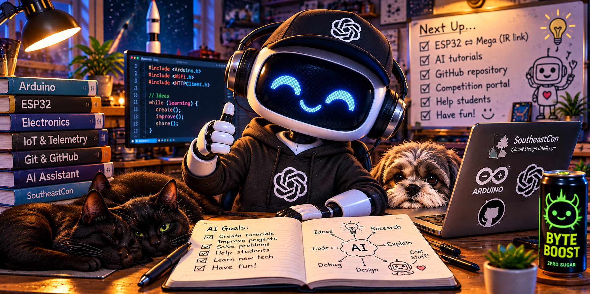

# AI

The **AI** tutorials will introduce students to practical applications of artificial intelligence as a tool for engineering and project development.

The emphasis will be on useful, hands-on applications rather than AI theory. Topics will focus on using AI to assist with tasks such as finding and understanding technical information, working with datasheets, troubleshooting hardware and software, and exploring engineering solutions.

## Future Topics

AI tutorials are planned for future development.

The specific topics and tutorials will be added as they are developed and tested.