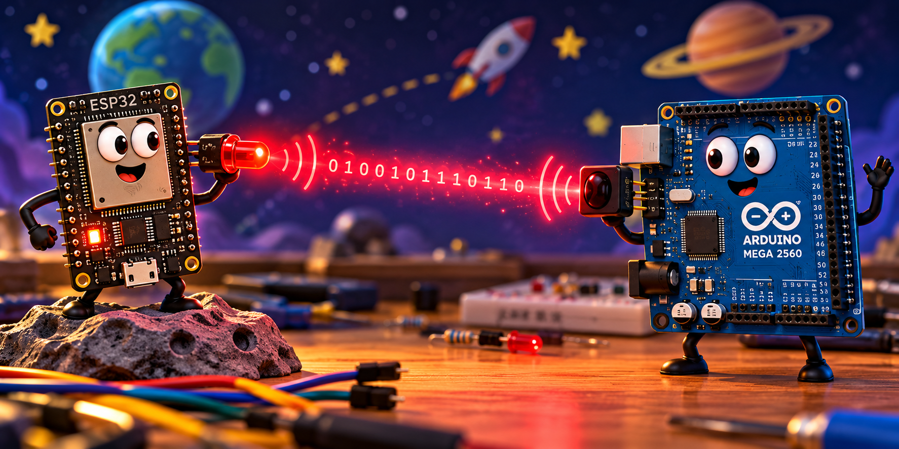

# Communications

The **Communications** tutorials introduce the techniques used to exchange information between the Arduino Mega 2560, ESP32, and other systems in the SoutheastCon Circuit Design Challenge. The tutorials emphasize understanding how each communication method works, testing each stage independently, and building progressively toward more capable communication systems.

Each tutorial builds on the information and techniques of the previous tutorials and are designed to be completed in their presented order.

The following tutorials are available as PDF documents. The editable Word (`.docx`) versions are also included in this directory.

## Tutorials

* [Direct Serial Communication](SoutheastCon_Communication_01_Direct_Serial.pdf)
* [Short IR Communication](SoutheastCon_Communication_02_Short_IR_Communication.pdf)
* [Modulated Infrared Communication](SoutheastCon_Communication_03_38kHz_Modulated_IR.pdf)
* [CRC Error Detection](SoutheastCon_Communication_04_CRC_Error_Detection.pdf)