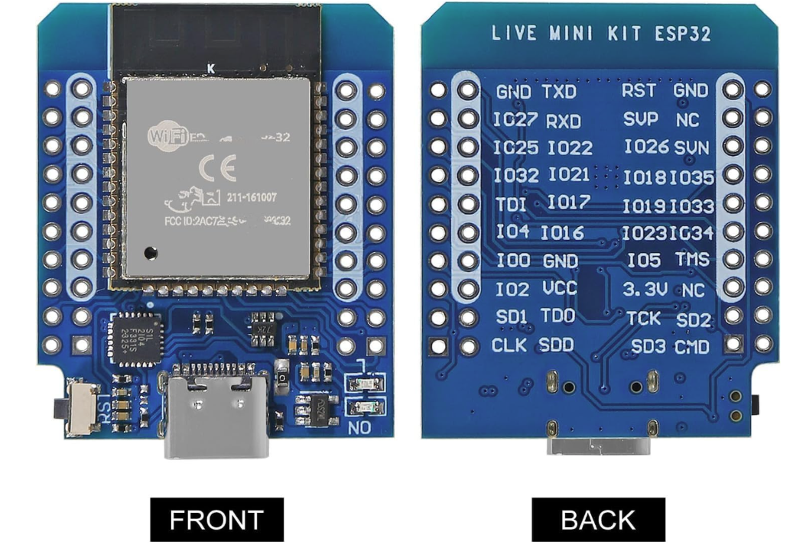

# ESP32 Tutorials

The following tutorials are available as PDF documents. The editable Word (`.docx`) versions are also included in this directory.

## Tutorials

- [Setup and First Circuit](SoutheastCon_ESP32_01_Setup_and_First_Circuit.pdf)
- [I2C OLED Display](SoutheastCon_ESP32_02_I2C_OLED_Display.pdf)
- [WiFi Connection](SoutheastCon_ESP32_03_WiFi_Connection.pdf)
- [HTTP POST Python Server](SoutheastCon_ESP32_04_HTTP_POST_Python_Server.pdf)
- [Periodic Sensor POST](SoutheastCon_ESP32_05_Periodic_Sensor_POST.pdf)
- [JSON POST](SoutheastCon_ESP32_06_JSON_POST.pdf)
- [Two Way Communication](SoutheastCon_ESP32_07_Two_Way_Communication.pdf)
