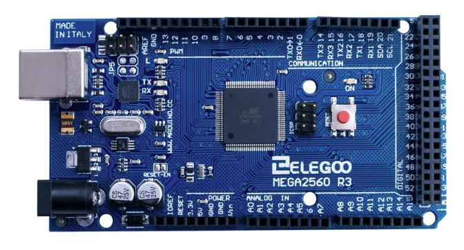

# Mega 2560 Tutorials

The following tutorials are available as PDF documents. The editable Word (`.docx`) versions are also included in this directory.

## Tutorials

- [Install the Arduino IDE](SoutheastCon_Arduino_01_Install_IDE.pdf)
- [Analog Input and Serial Output](SoutheastCon_Arduino_02_Analog_Input_Serial_Output.pdf)
- [Two Analog Inputs and Serial Plotter](SoutheastCon_Arduino_03_Two_Analog_Inputs_Serial_Plotter.pdf)
- [Non-Blocking Timing with millis()](SoutheastCon_Arduino_04_Non_Blocking_Timing_millis.pdf)
- [I2C Accelerometer](SoutheastCon_Arduino_05_I2C_Accelerometer.pdf)
