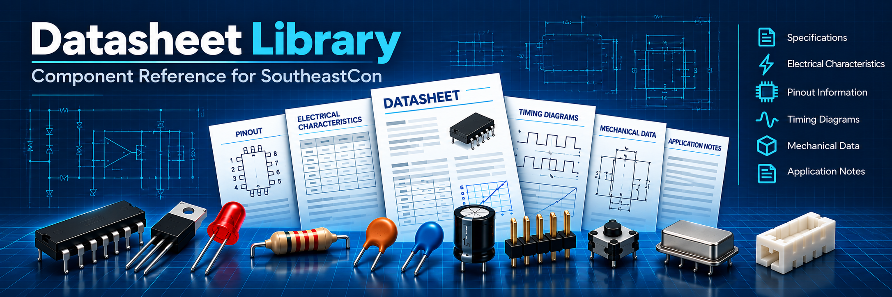

# Datasheets

This directory contains datasheets and technical reference documents for components used in the SoutheastCon Circuit Design Challenge tutorials and competitions.

These documents are provided as reference material. Students should refer to the appropriate documentation when a tutorial directs them to do so, or when additional information about a component's electrical characteristics, pinout, registers, timing, or operation is needed.

## Microcontrollers

### Arduino Mega 2560

[**ATmega640/1280/1281/2560/2561 Datasheet**](atmel-2549-8-bit-avr-microcontroller-atmega640-1280-1281-2560-2561_datasheet.pdf)

The ATmega2560 microcontroller is the processor used on the Arduino Mega 2560. This datasheet provides detailed information about the microcontroller's pins, memory, timers, ADC, UARTs, SPI, I2C, interrupts, and other internal peripherals.

### ESP32-WROOM-32

[**ESP32-WROOM-32 Datasheet**](esp32-wroom-32_datasheet_en.pdf)

The ESP32-WROOM-32 module is used in the ESP32 tutorials and in the communications exercises. The datasheet provides information about the module, power requirements, GPIO, UART, SPI, I2C, wireless capabilities, and other features.

> **Note:** This datasheet identifies the ESP32-WROOM-32 as **Not Recommended for New Designs (NRND)**. It is retained here because this is the module used by the competition hardware and tutorials.

## Communication Components

### TSSP93038SS1ZA 38 kHz IR Receiver

[**TSSP93038SS1ZA Datasheet**](tssp93038ss1za.pdf)

The Vishay TSSP93038SS1ZA is the 38 kHz infrared receiver used in the modulated IR communication tutorial.

The device responds to 38 kHz infrared bursts and provides an active-low digital output to the microcontroller. The datasheet contains the receiver's electrical characteristics, pinout, operating limits, and timing information.

This is an important reference for **Communication 03**.

### TSAL6200 Infrared LED

[**TSAL6200 Datasheet**](tsal6200.pdf)

The Vishay TSAL6200 is a high-power 940 nm infrared-emitting diode used with the TSSP93038SS1ZA receiver.

The datasheet provides information about forward voltage, forward current, pulse operation, radiant intensity, wavelength, package dimensions, and other electrical and optical characteristics.

This is an important reference for **Communication 03**.
## Sensors and Measurement

### INA219 Current/Power Monitor

[**INA219 Datasheet**](ina219.pdf)

The INA219 is a bidirectional current and power monitor with an I2C interface. It can measure bus voltage and shunt voltage and can report calculated current and power.

The datasheet includes information about the device's electrical characteristics, I2C interface, configuration registers, calibration, and measurement operation.

### ADXL345 3-Axis Accelerometer

[**ADXL345 Datasheet**](adxl345.pdf)

The ADXL345 is a digital three-axis accelerometer with selectable measurement ranges and both I2C and SPI interfaces.

The datasheet provides information about the sensor's operating modes, registers, measurement ranges, interrupts, and serial interfaces.

### MPU-6050

[**MPU-6000/MPU-6050 Register Map and Descriptions**](RM-MPU-6000A.pdf)

This document is the **MPU-6000/MPU-6050 Register Map and Descriptions** from InvenSense. It provides detailed information about the MPU-6050's registers and configuration.

This document is useful when a tutorial requires students to work directly with the MPU-6050's registers or configure its accelerometer and gyroscope.

> **Note:** This is a register-map reference rather than a complete MPU-6050 datasheet.

### HC-SR04 Ultrasonic Distance Sensor

[**HC-SR04 Ultrasonic Module Reference**](hc-sr04_ultrasonic_module.pdf)

The HC-SR04 is an ultrasonic distance-measurement module that uses a trigger pulse and an echo pulse to measure the time required for an ultrasonic burst to travel to an object and return.

This reference provides information about the module's pins, trigger and echo timing, operating voltage, measurement range, and basic connection and timing requirements.

### DS1307 Real-Time Clock

[**DS1307 Real-Time Clock Datasheet**](ds1307.pdf)

The DS1307 is an I2C real-time clock/calendar device that maintains seconds, minutes, hours, day, date, month, and year information. It includes battery-backed timekeeping so the clock can continue operating when primary power is removed.

The datasheet provides information about the I2C interface, register map, timekeeping operation, oscillator requirements, electrical characteristics, and battery-backed operation.

## Displays and Output Devices

### SSD1306 OLED Controller

[**SSD1306 Datasheet**](SSD1306.pdf)

The SSD1306 is the display controller used by many small monochrome OLED modules.

The datasheet provides information about the controller's display memory, commands, interfaces, timing, electrical characteristics, and configuration.

The specific OLED modules used in the tutorials may contain additional circuitry beyond the SSD1306 controller itself. Module-specific documentation may therefore differ from this controller datasheet.

### MAX7219 / MAX7221 LED Display Drivers

[**MAX7219/MAX7221 Datasheet**](max7219-max7221.pdf)

The MAX7219 and MAX7221 are serially interfaced display drivers for controlling common-cathode LED displays, bar graphs, and individual LEDs. They provide an SPI-compatible serial interface and reduce the number of microcontroller pins required to control multiple display elements.

The datasheet provides information about the serial interface, register format, scan operation, current programming, display configuration, and electrical characteristics.

## Input and Identification Components

### MFRC522 RFID Reader IC

[**MFRC522 Datasheet**](MFRC522.pdf)

The MFRC522 is a highly integrated reader/writer IC for contactless communication at 13.56 MHz. It is commonly found on inexpensive RFID/NFC reader modules used with microcontrollers.

The datasheet provides information about the RF interface, supported communication protocols, registers, SPI/serial interfaces, operating modes, and electrical characteristics.

## General purpose ICs and active devices

### SN74HC595 8-Bit Shift Register

[**SN74HC595 Datasheet**](sn74hc595.pdf)

The SN74HC595 is an 8-bit serial-in, parallel-out shift register with a storage register and tri-state outputs. It allows a microcontroller to control multiple digital outputs using a small number of pins.

The datasheet provides information about the serial interface, latch and output-enable controls, timing requirements, logic levels, and electrical characteristics.

### ULN2003A Darlington Transistor Array

[**ULN2003A Datasheet**](uln2003a.pdf)

The ULN2003A is a seven-channel Darlington transistor array designed to allow low-current logic outputs to drive higher-current loads. It includes integrated clamp diodes for inductive loads such as relays, motors, and solenoids.

The datasheet provides pinout information, output-current capabilities, saturation characteristics, clamp-diode details, and operating limits.

### 2N2222 NPN Transistor

[**2N2222 Datasheet**](DS_2n2222.pdf)

The 2N2222 is a general-purpose NPN bipolar junction transistor commonly used for switching and amplification. In tutorial circuits it can be used as a low-side switch to control loads that cannot be driven directly from a microcontroller GPIO.

The datasheet provides pin configuration, maximum ratings, current and voltage characteristics, and switching specifications.

### 1N4001 Rectifier Diode

[**1N4001 Datasheet**](1n4001.pdf)

The 1N4001 is a general-purpose silicon rectifier diode rated for applications involving rectification and protection. It can also be used as a simple protection diode across inductive loads when appropriate.

The datasheet provides forward-voltage, reverse-voltage, current, leakage, and other electrical characteristics.

## Using the Datasheets

Datasheets are technical reference documents and are not intended to replace the tutorial instructions.

When working through the tutorials:

1. Follow the tutorial instructions first.
2. Use the datasheet to look up information about the component when directed to do so.
3. Pay particular attention to **pin assignments, supply voltage, logic levels, absolute maximum ratings, and electrical characteristics** when connecting hardware.
4. Do not assume that two components with similar names or functions have identical electrical characteristics.

The datasheet is the authoritative source for the electrical and operating specifications of the component it documents.

## Document Sources

The documents in this directory were obtained from component manufacturers or reputable electronics distributors and resellers. Where possible, the original manufacturer's documentation is used.

Datasheets are provided for educational and reference purposes as part of the SoutheastCon Circuit Design Challenge tutorial materials.

